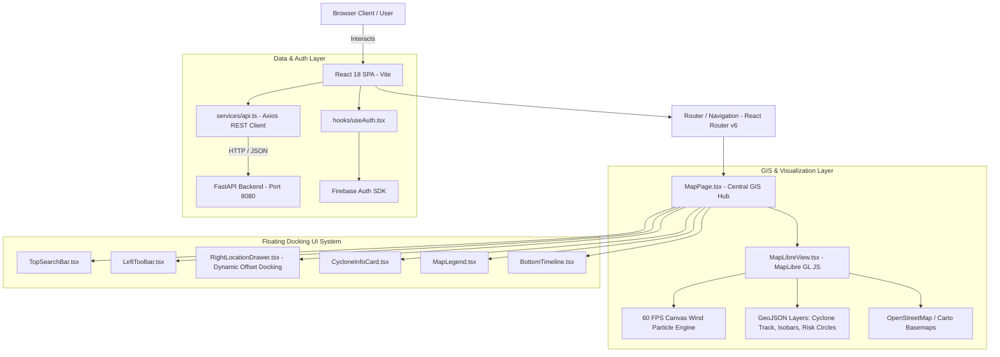

# 🌀 CycloneShield AI — Frontend Architecture & Component Documentation

Welcome to the **CycloneShield AI Frontend Workspace** documentation. This client application is a high-performance, real-time interactive weather and disaster risk assessment web interface built with **React 18**, **TypeScript**, **Vite**, **Tailwind CSS**, **MapLibre GL JS**, and an ultra-optimized **60 FPS Canvas Particle Animation Engine**.

---

## 📐 1. System Architecture & UI Design Concept

The CycloneShield AI frontend provides a **Zoom-Earth style interactive GIS workspace** tailored for emergency responders, meteorologists, and coastal risk analysts in the Bay of Bengal and APAC region.



### Key Design Principles:
1. **Interactive GIS First**: The entire user experience revolves around seamless, hardware-accelerated spatial map exploration with zero basemap obstruction.
2. **Dynamic UI Overlay Docking**: Right-hand floating card components (`MapLegend`, `CycloneInfoCard`, etc.) dynamically dock at `right-4` when the drawer is closed, and smoothly transition to `right-4` relative to the drawer bounds (`sm:right-[410px]`) when the right drawer opens.
3. **60 FPS Canvas Particle Engine**: Wind velocity vectors ($U, V$) are converted into smooth particle trajectories rendered on an overlaid HTML5 `<canvas>`. The engine uses `destination-out` composite operations for smooth motion trails while leaving underlying basemap labels sharp and visible.
4. **Resilient Data Fallbacks**: Gracefully handles live GDACS API data, Open-Meteo spatial grids, and offline fallback scenarios with clear provenance indicators.

---

## 📁 2. Complete Frontend Directory Structure

```
frontend/
├── public/                     # Static public assets, markers, icons
├── src/
│   ├── assets/                 # SVGs, images, and brand assets
│   ├── components/
│   │   ├── auth/               # Authentication modals and forms
│   │   │   ├── LoginModal.tsx
│   │   │   └── ProtectedRoute.tsx
│   │   ├── common/             # Reusable UI primitives (Buttons, Badges, Modals)
│   │   │   ├── Badge.tsx
│   │   │   ├── Card.tsx
│   │   │   ├── Modal.tsx
│   │   │   └── Spinner.tsx
│   │   ├── layout/             # Top Navigation, Sidebars, Footers
│   │   │   ├── Footer.tsx
│   │   │   ├── Header.tsx
│   │   │   └── Sidebar.tsx
│   │   ├── location/           # Location details & search widgets
│   │   │   └── LocationSearchModal.tsx
│   │   ├── map/                # MapLibre GIS Overlays & Controls (22 Components)
│   │   │   ├── AlertsOverlayPanel.tsx          # Real-time alert notifications overlay
│   │   │   ├── BottomTimeline.tsx              # 7-Day / 24-Hour forecast timeline player
│   │   │   ├── CopilotDrawer.tsx               # AI Copilot assistant side drawer
│   │   │   ├── CycloneInfoCard.tsx             # Floating storm telemetry card
│   │   │   ├── CyclonePlaybackControls.tsx     # Cyclone movement scrubber
│   │   │   ├── DataSourcesOverlayPanel.tsx     # Data provenance & API status modal
│   │   │   ├── DataStatusPanel.tsx             # Real-time data pipeline indicator
│   │   │   ├── ForecastPointPopup.tsx          # Map click point inspection popup
│   │   │   ├── InfoPanel.tsx                   # Layer details panel
│   │   │   ├── InfrastructureDetailPanel.tsx   # GIS facility inspection drawer
│   │   │   ├── InfrastructureOverlayPanel.tsx  # Hospital/Port filter checkboxes
│   │   │   ├── LayerControls.tsx               # Layer toggle quick bar
│   │   │   ├── LayerSelectorModal.tsx          # Full layer management dialog
│   │   │   ├── LeftToolbar.tsx                 # Vertical quick-mode switcher toolbar
│   │   │   ├── MapLegend.tsx                   # Dynamic color scale legend
│   │   │   ├── MapLibreView.tsx                # MapLibre GL Map Core & Particle Canvas
│   │   │   ├── MapVisualization.tsx            # GIS wrapper component
│   │   │   ├── NaturalLanguageQueryBar.tsx     # AI natural language search box
│   │   │   ├── RightLocationDrawer.tsx         # Comprehensive risk & shelter drawer
│   │   │   ├── SettingsOverlayPanel.tsx        # Map preferences panel
│   │   │   ├── SimulationOverlayPanel.tsx      # Cyclone simulation control panel
│   │   │   └── TopSearchBar.tsx                # Floating top search header bar
│   │   └── simulation/         # Hurricane track simulation widgets
│   ├── firebase/               # Firebase initialization & auth configuration
│   │   └── config.ts           # SDK init (Auth, Analytics)
│   ├── hooks/                  # Custom React Hooks
│   │   ├── useAuth.tsx         # Firebase Auth context & session state
│   │   └── useUserLocation.tsx # Geolocation API & reverse geocoding
│   ├── pages/                  # Main Application Pages (19 Views)
│   │   ├── AboutPage.tsx       # System overview & methodology
│   │   ├── ActionCenterPage.tsx# Emergency evacuation & preparedness dashboard
│   │   ├── AlertsPage.tsx      # Active cyclone & flood alerts page
│   │   ├── CopilotPage.tsx     # Fullscreen AI Copilot interface
│   │   ├── DashboardPage.tsx   # Executive disaster overview & analytics
│   │   ├── DataSourcesPage.tsx # Data feed status & API latency monitor
│   │   ├── FloodPage.tsx       # Coastal surge & flood risk analyzer
│   │   ├── ForecastPage.tsx    # Multi-model weather forecast comparison
│   │   ├── HistoryPage.tsx     # Historical cyclone archive & playback
│   │   ├── InfrastructurePage.tsx # Critical asset vulnerability manager
│   │   ├── LandingPage.tsx     # Public promotional landing page
│   │   ├── LoginPage.tsx       # Authentication & sign-in page
│   │   ├── MapPage.tsx         # Main 60 FPS Interactive Weather GIS Map
│   │   ├── ReportsPage.tsx     # Automated PDF/Markdown risk report generator
│   │   ├── RiskMapPage.tsx     # Dedicated spatial risk map view
│   │   ├── RiskPage.tsx        # District-level risk matrix view
│   │   ├── SatellitePage.tsx   # MODIS/VIIRS satellite imagery viewer
│   │   ├── SettingsPage.tsx    # User settings & API key management
│   │   └── SimulationPage.tsx  # Dynamic storm track scenario runner
│   ├── routes/                 # React Router v6 Configuration
│   │   └── index.tsx           # Route definitions & lazy loading
│   ├── services/               # API Integration Services
│   │   ├── api.ts              # Axios client connecting to FastAPI backend
│   │   └── mapService.ts       # Tile server & basemap URL utilities
│   ├── types/                  # TypeScript Data Models & Interfaces
│   │   ├── cyclone.ts          # Cyclone track, forecast point, GDACS schemas
│   │   ├── infrastructure.ts   # Hospital, evacuation shelter, power grid schemas
│   │   ├── risk.ts             # Risk index formula & vulnerability schemas
│   │   └── weather.ts          # Spatial grid, temperature, pressure schemas
│   ├── utils/                  # Utility Functions
│   │   ├── formatters.ts       # Wind speed (kt/km/h/mph), pressure, date formatting
│   │   ├── geo.ts              # Haversine distance, bounding box calculations
│   │   └── riskCalculator.ts   # Client-side risk scoring fallback
│   ├── App.css                 # Global animations & canvas styles
│   ├── App.tsx                 # Root application component
│   ├── index.css               # Tailwind CSS directives & custom utility classes
│   └── main.tsx                # React DOM entrypoint
├── .env                        # Environment variables configuration
├── index.html                  # HTML5 template
├── package.json                # Project dependencies & scripts
├── tailwind.config.js          # Tailwind CSS theme extension
├── tsconfig.json               # TypeScript compiler config
└── vite.config.ts              # Vite bundle & dev server config
```

---

## 🎨 3. Interactive Weather & Disaster Overlay Modes

The interactive map (`MapPage.tsx` + `MapLibreView.tsx`) supports **10 distinct overlay modes**, navigable via `LeftToolbar.tsx` or `LayerSelectorModal.tsx`:

| Mode Key | Name | Visual Representation | Data Source |
| :--- | :--- | :--- | :--- |
| `wind` | **Wind Streamlines** | 60 FPS Animated vector field + color gradient | Open-Meteo spatial $U/V$ grid |
| `cyclone` | **Cyclone Track** | Observed path (solid) + Forecast cone (dashed) | GDACS Live API + IMD |
| `temperature` | **Temperature Heatmap** | Continuous color ramp ($10^\circ\text{C}$ to $45^\circ\text{C}$) | Open-Meteo spatial grid |
| `pressure` | **Isobar Lines** | Contour lines labeled with hPa values | Open-Meteo pressure grid |
| `precipitation` | **Rainfall Radar** | Precipitation intensity layer ($\text{mm/h}$) | Open-Meteo precipitation grid |
| `humidity` | **Relative Humidity** | Moisture distribution gradient ($0\% - 100\%$) | Open-Meteo humidity grid |
| `clouds` | **Cloud Cover** | Satellite cloud coverage opacity overlay | Open-Meteo cloud cover grid |
| `radar` | **Doppler Radar** | Simulated coastal Doppler reflectivity ($\text{dBZ}$) | Coastal radar network feed |
| `waves` | **Ocean Wave Height** | Wave height contours ($\text{meters}$) | Open-Meteo Marine API |
| `satellite` | **Satellite Imagery** | MODIS / VIIRS true-color satellite basemap | NASA GIBS / ESA Sentinel |

---

## ⚡ 4. 60 FPS Canvas Wind Particle Engine

The wind velocity field visualization in `MapLibreView.tsx` is powered by a high-performance 2D Canvas rendering loop:

### Implementation Details:
1. **Bilinear Spatial Interpolation**:
   Given a grid of wind vector points across latitude/longitude boundaries:
   $$\vec{V}(\lambda, \phi) = (1-u)(1-v)\vec{V}_{00} + u(1-v)\vec{V}_{10} + (1-u)v\vec{V}_{01} + uv\vec{V}_{11}$$
   The particle engine calculates local velocity $(U, V)$ in knots or $\text{m/s}$ for any continuous point on the screen.
2. **Screen Space Vector Projection**:
   Map coordinates $(\text{lng}, \text{lat})$ are mapped to screen pixels $(x, y)$ using MapLibre's `map.project()`.
3. **Trail Fading Effect**:
   Instead of clearing the canvas completely on each frame (`clearRect`), the engine applies a slight fading rectangle using composite operations:
   ```typescript
   ctx.globalCompositeOperation = 'destination-out';
   ctx.fillStyle = 'rgba(0, 0, 0, 0.12)';
   ctx.fillRect(0, 0, width, height);
   ctx.globalCompositeOperation = 'source-over';
   ```
   This technique leaves smooth, decaying motion trails behind particles while allowing basemap tiles to remain 100% visible beneath the transparent canvas element.

---

## 🛠️ 5. Setup, Build & Development

### Prerequisites:
- **Node.js**: v18.0.0 or higher
- **npm**: v9.0.0 or higher

### Environment Configuration (`frontend/.env`):
Create a `.env` file in `frontend/`:
```ini
# Backend API Endpoint
VITE_API_BASE_URL=http://127.0.0.1:8080/api/v1

# Firebase Auth Configuration (Optional for production auth)
VITE_FIREBASE_API_KEY=your_firebase_api_key
VITE_FIREBASE_AUTH_DOMAIN=your_project.firebaseapp.com
VITE_FIREBASE_PROJECT_ID=your_project_id
VITE_FIREBASE_STORAGE_BUCKET=your_project.appspot.com
VITE_FIREBASE_MESSAGING_SENDER_ID=your_sender_id
VITE_FIREBASE_APP_ID=your_app_id
```

### Development Commands:

#### 1. Install Dependencies
```bash
cd frontend
npm install
```

#### 2. Start Vite Development Server
```bash
npm run dev
```
The application will launch locally at `http://localhost:5173`.

#### 3. TypeScript Type-Checking
```bash
npx tsc -b
```
Runs strict TypeScript compilation checks across all pages, components, and services.

#### 4. Production Build
```bash
npm run build
```
Generates an optimized static production bundle in `frontend/dist/`.

#### 5. Preview Production Build Locally
```bash
npm run preview
```

---

## 🔐 6. Firebase Authentication Integration

Authentication is managed via `src/hooks/useAuth.tsx` and `src/firebase/config.ts`:

- **Auth Providers**: Google OAuth Sign-In & Email/Password login.
- **State Persistence**: Sessions persist in `localStorage` / IndexedDB via Firebase Web SDK.
- **Route Guard**: `ProtectedRoute.tsx` wraps sensitive pages like `/action-center`, `/simulation`, and `/settings` to ensure authenticated access.

---

## 📊 7. API Service Layer (`src/services/api.ts`)

The frontend communicates with the FastAPI backend through a typed Axios instance with automatic response transformation:

```typescript
import axios from 'axios';

const API_BASE_URL = import.meta.env.VITE_API_BASE_URL || 'http://127.0.0.1:8080/api/v1';

export const api = axios.create({
  baseURL: API_BASE_URL,
  headers: {
    'Content-Type': 'application/json',
  },
});

// Endpoint Methods
export const getLiveCyclones = () => api.get('/cyclone/live');
export const getWeatherGrid = (bounds: Bounds) => api.post('/weather/grid', bounds);
export const getInfrastructure = (params: InfraParams) => api.get('/infrastructure', { params });
export const calculateRiskScore = (data: RiskPayload) => api.post('/risk/calculate', data);
```

---

## 🔍 8. Troubleshooting & Performance Best Practices

> [!TIP]
> **Canvas Performance**: If particle animation stutters on high-DPI displays (4K monitors), the canvas scaling factor automatically caps pixel ratio at `Math.min(window.devicePixelRatio, 2)` to preserve rendering speed.

> [!IMPORTANT]
> **CORS Configuration**: If the frontend fails to fetch data from `http://127.0.0.1:8080`, ensure the backend FastAPI app has CORS middleware enabled allowing `http://localhost:5173`.

> [!NOTE]
> **Basemap Tile Rate Limits**: Carto and OpenStreetMap tile servers are cached locally in browser memory using MapLibre GL's built-in tile cache.

---

<p align="center">
  <b>CycloneShield AI Frontend Workspace</b> • Built for Coastal APAC Resiliency
</p>
